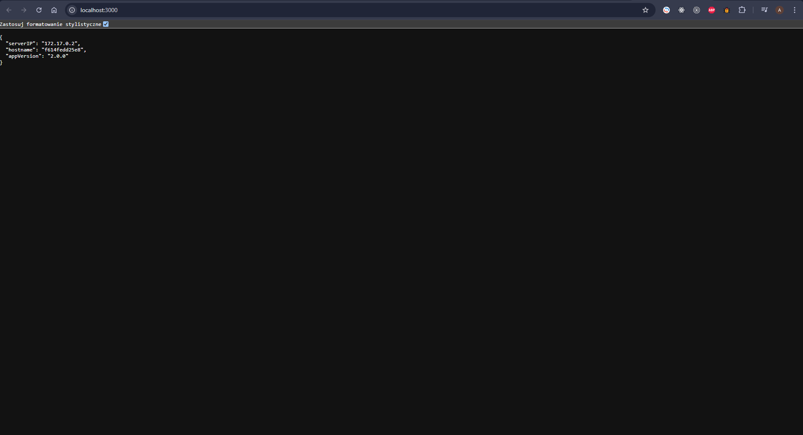
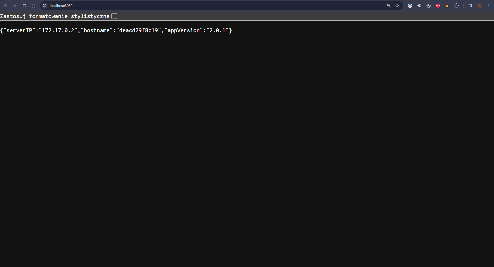

# Backend Express + TypeScript + Docker

## Opis

To backendowa aplikacja napisana w Node.js z wykorzystaniem Express i TypeScript.  
Aplikacja działa w kontenerze Docker, bazując na lekkim systemie Alpine Linux.  
Kod źródłowy jest kompilowany do JavaScript przed uruchomieniem w kontenerze.

---

## Zadanie 1 (bez użycia serwera ngnix)

### 1. **Zbudowanie obrazu Docker**

Aby zbudować obraz aplikacji, użyj następującego polecenia:

```bash
docker build --build-arg VERSION=2.0.0 -t my-backend-app .
```

### Wynik działania polecenia build

```bash
[+] Building 1.0s (11/11) FINISHED                                                                                  docker:desktop-linux
 => [internal] load build definition from Dockerfile                                                                0.0s
 => => transferring dockerfile: 1.33kB                                                                              0.0s
 => [internal] load .dockerignore                                                                                   0.0s
 => => transferring context: 416B                                                                                   0.0s
 => [internal] load build context                                                                                   0.0s
 => => transferring context: 202B                                                                                   0.0s
 => CACHED [base 1/1] ADD alpine-minirootfs-3.21.3-x86_64.tar /                                                     0.0s
 => CACHED [builder 1/6] RUN apk add --no-cache nodejs pnpm                                                         0.0s
 => CACHED [builder 2/6] WORKDIR /app                                                                               0.0s
 => CACHED [builder 3/6] COPY package.json tsconfig.json .env ./                                                    0.0s
 => CACHED [builder 4/6] RUN pnpm install                                                                           0.0s
 => CACHED [builder 5/6] COPY src ./src                                                                             0.0s
 => CACHED [builder 6/6] RUN pnpm build                                                                             0.0s
 => exporting to image                                                                                              0.6s
 => => exporting layers                                                                                             0.0s
 => => exporting manifest sha256:570f9e2f1cc152fd6b7226197221487c2602fff7d006d54fcaf85bf226586cdd                   0.0s
 => => exporting config sha256:9328567b17b68cadd54c0304308749b329677355c778d46a8c4f5460592c6abb                     0.0s
 => => exporting attestation manifest sha256:4b504e75cb38b0f1d7693add5d8401d6f1311382f1598e582938e35a3c748b19       0.3s
 => => exporting manifest list sha256:26628b8be9f6ed4dbb653aad2805a1978561a275317ef025746aef87a9edf806              0.0s
 => => naming to docker.io/library/my-backend-app:latest                                                            0.0s
 => => unpacking to docker.io/library/my-backend-app:latest                                                         0.0s
```

### 2. Uruchomienie kontenera

Po zbudowaniu obrazu uruchom aplikację:

```bash
docker run -d -p 3000:3000 --name backend my-backend-app
```

### 3. Wyświetlenie uruchomionych kontenerów

```bash
> docker ps
CONTAINER ID   IMAGE                  COMMAND                  CREATED              STATUS                    PORTS                    NAMES
ccba38efe70b   my-backend-app         "pnpm start"             About a minute ago   Up About a minute         0.0.0.0:3000->3000/tcp   backend
```

Aplikacja będzie dostępna na `http://localhost:3000/`

### 3. Sprawdzenie działania aplikacji

Aby sprawdzić, czy aplikacja działa, użyj:

```bash
curl http://localhost:3000/
```

Jeśli aplikacja działa poprawnie, powinieneś otrzymać odpowiedź JSON

### Wynik działania aplikacji



---

## Zadanie 2 (Dodatkowa warstwa nginx)

## Uwagi

Rozumiem, że w treści zadania najprawdopodobniej chodziło o statyczną stronę HTML. Niemniej jednak, postanowiłem podjąć próbę realizacji zadania na aplikacji backendowej. W związku z tym konieczne było skonfigurowanie serwera Nginx jako reverse proxy, aby odpowiednio kierować zapytania HTTP do aplikacji backendowej. Mam nadzieję, że ta zmiana nie wpłynie negatywnie na ocenę końcową. 🤗

## 1. **Zbudowanie obrazu Docker**

Aby zbudować obraz z reverse proxy, użyj następującego polecenia:

```bash
docker build --build-arg VERSION=2.0.1 -f Dockerfile_nginx -t my-nginx-backend-app .
```

## Wynik polecenia:

```bash
[+] Building 1.2s (17/17) FINISHED docker:desktop-linux
 => [internal] load build definition fromDockerfile_nginx                                                                           0.0s
 => => transferring dockerfile: 2.50kB                                                                                              0.0s
 => [internal] load metadata for docker.io/library/nginx:alpine                                                                     0.5s
 => [internal] load .dockerignore                                                                                                   0.0s
 => => transferring context: 416B                                                                                                   0.0s
 => [internal] load build context                                                                                                   0.0s
 => => transferring context: 232B                                                                                                   0.0s
 => [nginx-server 1/5] FROM docker.io/library/nginx:alpine@sha256:4ff102c5d78d254a6f0da062b3cf39eaf07f01eec0927fd21e219d0af8bc0591  0.1s
 => => resolve docker.io/library/nginx:alpine@sha256:4ff102c5d78d254a6f0da062b3cf39eaf07f01eec0927fd21e219d0af8bc0591               0.1s
 => CACHED [nginx-server 2/5] RUN apk add --no-cache nodejs pnpm                                                                    0.0s
 => CACHED [nginx-server 3/5] WORKDIR /app                                                                                          0.0s
 => CACHED [base 1/1] ADD alpine-minirootfs-3.21.3-x86_64.tar /                                                                     0.0s
 => CACHED [builder 1/6] RUN apk add --no-cache nodejs pnpm                                                                         0.0s
 => CACHED [builder 2/6] WORKDIR /app                                                                                               0.0s
 => CACHED [builder 3/6] COPY package.json tsconfig.json .env ./                                                                    0.0s
 => CACHED [builder 4/6] RUN pnpm install                                                                                           0.0s
 => CACHED [builder 5/6] COPY src ./src                                                                                             0.0s
 => CACHED [builder 6/6] RUN pnpm build                                                                                             0.0s
 => CACHED [nginx-server 4/5] COPY --from=builder /app ./                                                                           0.0s
 => CACHED [nginx-server 5/5] COPY nginx.conf /etc/nginx/nginx.conf                                                                 0.0s
 => exporting to image                                                                                                              0.2s
 => => exporting layers                                                                                                             0.0s
 => => exporting manifest sha256:8e608c4c20f331f3d7d4f466ec0b71bc7164b6f1808aacbde1e07ef8f04080f9                                   0.0s
 => => exporting config sha256:99671f39c91a6b1cde662f8275c8e69b095f05ed4f5d1ea342d65ea61fe2f3e1                                     0.0s
 => => exporting attestation manifest sha256:15f3053fee7bb4d4944588a2484575943c1633777217585c256fe66e34bb099a                       0.1s
 => => exporting manifest list sha256:b494835646e2d83b09cd88771586a86041b8783db41df56ddee6adbbab25ff93                              0.0s
 => => naming to docker.io/library/my-nginx-backend-app:latest                                                                      0.0s
 => => unpacking to docker.io/library/my-nginx-backend-app:latest                                                                   0.0s
```

## 2. **Uruchomienie kontenera z reverse proxy**

Po zbudowaniu obrazu uruchom aplikację z Nginx:

```bash
docker run -d -p 8080:80 --name nginx-backend my-nginx-backend-app
```

Aplikacja będzie teraz dostępna na `http://localhost:8080/.` Nginx działa jako reverse proxy, przekierowując zapytania HTTP do aplikacji `Node.js` na porcie `3000`.

## 3. **Wyświetlenie uruchomionych kontenerów**

```bash
> docker ps
CONTAINER ID   IMAGE              COMMAND                  CREATED          STATUS                    PORTS                  NAMES
4554daf4446e   my-nginx-backend   "/docker-entrypoint.…"   18 seconds ago   Up 18 seconds (healthy)   0.0.0.0:8080->80/tcp   nginx-backend
```

Widać, że kontener jest uruchomiony i oznaczony jako healthy. To oznacza, że health check skonfigurowany w pliku Dockerfile działa poprawnie, a aplikacja backendowa jest gotowa do obsługi zapytań.

## 4. **Sprawdzenie działania aplikacji**

Aby sprawdzić, czy aplikacja działa poprawnie z Nginx jako reverse proxy, użyj:

```bash
curl http://localhost:8080/
```

Jeśli aplikacja działa poprawnie, powinieneś otrzymać odpowiedź JSON

## **Wynik działania aplikacji**


